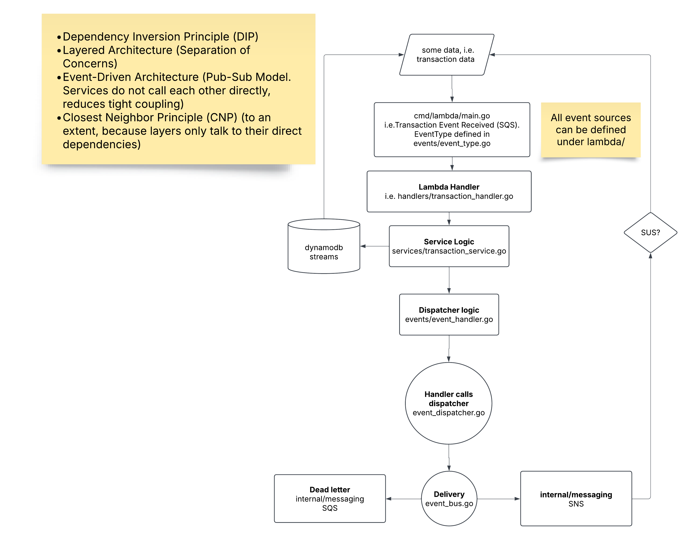

# GreenFlag Architecture Design

## Overview
This repository contains a **serverless event-driven architecture** built using **AWS Lambda, Amazon SQS, Amazon SNS, and DynamoDB**. The system is designed to process transactions, detect fraud, and notify users via email/SMS.

### **Key Features**
- **AWS Lambda:** Runs stateless functions triggered by SQS messages, SNS notifications, or API Gateway requests.
- **Amazon SQS:** Used for queueing transactions before processing.
- **Amazon SNS:** Sends notifications to users regarding fraud alerts.
- **Amazon DynamoDB:** Stores transactions and account details efficiently.
- **Event-Driven Processing:** Uses an `events` package to manage different types of events.
- **Structured Logging:** Uses a `logging` package for observability.
- **Infrastructure as Code:** Deployment is handled using AWS SAM (Serverless Application Model).

## **Project Structure**
```
project-root/
├── cmd/
│   └── lambda/
│       └── fraud/fraud_pipeline.go  # Entry point for Lambda function
│       └── response/response_pipeline.go
│       └── retry/fraud_retry_pipeline.go
│       └── transactions/transaction_pipeline.go
├── internal/
│   ├── config/
│   │   └── config.go  # Handles app config & environment variables
│   ├── db/
│   │   ├── repository.go  # Generic DB repository interface
│   │   ├── dynamo.go  # DynamoDB implementation
│   ├── messaging/
│   │   ├── sns.go  # SNS message publisher
│   │   ├── sqs.go  # SQS consumer for event messages
│   ├── models/
│   │   ├── transaction.go  # Transaction model
│   │   ├── account.go  # Account model
│   ├── services/
│   │   ├── transaction_service.go  # Transaction processing
│   │   ├── fraud_service.go  # Fraud detection logic
│   │   ├── notification_service.go  # Handles SNS alerts
│   ├── events/
│   │   ├── event_types.go  # Defines different event types
│   │   ├── event_dispatcher.go  # Central logic for publishing events, uses event_bus
|   |   ├── event_bus.go  # Utilized by event_dispatcher to invoke appropriate methods from internal/messaging
│   │   ├── event_handlers.go  # Handlers for processing incoming events
│   ├── handlers/
│   │   ├── transaction_handler.go  # Handles Lambda triggers for transactions
│   │   ├── fraud_handler.go  # Processes fraud-related events
│   │   ├── response_handler.go  # Handles user Yes/No responses from SNS
│   │   ├── fraud_retry_handler.go  # Retries failed fraud-related events
│   ├── logging/
│   │   └── logger.go  # Implements structured logging
│   ├── middleware/
│   │   ├── error_handler.go  # Centralized error handling
│   ├── observability/
│   │   ├── tracing.go  # OpenTelemetry (optional)
│   │   ├── metrics.go  # AWS CloudWatch metrics collection
├── test/
│   ├── events_test.go  # Test event-driven logic
│   ├── db_test.go  # Test DynamoDB logic
│   ├── fraud_test.go  # Test fraud detection
│   ├── transaction_test.go  # Test transactions
│   ├── messaging_test.go  # Test SNS & SQS messaging
├── deployments/
│   ├── template.yaml  # AWS SAM configuration file
│   ├── samconfig.toml  # SAM deployment config
├── go.mod
├── go.sum
├── Makefile  # Build, test, deploy commands
```

## Core Dependency Flow
```bash
handlers → services → events → messaging → db
```
| **Component**            | **Depends On**                   | **Purpose** | **Example** |
|-------------------------|--------------------------------|-------------|------------|
| `cmd/lambda/transactions/transaction_pipeline.go`     | `handlers/`                     | Entry point for AWS Lambda. | The `transaction_pipeline.go` file starts the Lambda function and calls `TransactionHandler` when an event is received. |
| `handlers/`             | `services/`, `events/`          | Processes Lambda requests and routes them. | The `TransactionHandler` in `internal/handlers/transaction_handler.go` should receive an event from AWS Lambda (triggered by SQS or API Gateway), parse it, and pass it to `event_handlers.go` for processing. |
| `services/`             | `events/`, `db/`, `messaging/`  | Business logic layer (transaction processing, fraud detection). | `ProcessTransaction` in `transaction_service.go` checks for fraud, stores the transaction in DynamoDB, and dispatches a `TransactionCreated` event. |
| `events/`               | `messaging/`                    | Defines events, publishes them, and processes incoming events. | The `event_handlers.go` file routes a `TransactionCreated` event to `ProcessTransaction`, and `event_dispatcher.go` sends it to SNS or SQS via the `event_bus`. |
| `messaging/`            | AWS SDK (`sns.go`, `sqs.go`)    | Handles actual AWS messaging logic. | `sns.go` publishes fraud alerts to an SNS topic, while `sqs.go` receives messages from the transaction queue. |
| `db/`                   | AWS SDK (`dynamo.go`)           | Manages data persistence in DynamoDB. | `dynamo.go` saves new transactions in the `Transactions` table and retrieves them when needed. |

## Program Flow


## High Level Diagram

## **Getting Started**
### **Prerequisites**
Ensure you have the following installed:
- **Go 1.x** (for building the Lambda function)
- **AWS CLI** (for interacting with AWS services)
- **AWS SAM CLI** (for deploying the infrastructure)
- **Docker** (optional, for testing Lambda locally)

### **Installation & Setup**
1. Clone the repository
2. Initialize Go modules:
   ```sh
   go mod tidy
   ```

## **Deployment**
The project uses AWS **SAM (Serverless Application Model)** for deployment.


## **Deploy to AWS**
To deploy the project to AWS, use the following command:
```sh
sam deploy --template-file deployments/template.yaml --guided
```
This will:
- Package and upload the Lambda functions.
- Hook your lambda to an SQS queue, SNS topic, and DynamoDB table.
- Deploy necessary IAM roles and permissions.

### **Manually Send a Transaction to SQS**
Send a test transaction to the SQS queue:
```sh
aws sqs send-message --queue-url <YOUR_QUEUE_URL> --message-body '{"transactionID": "123", "amount": 50, ...}'
```
Example:
```sh
aws sqs send-message --queue-url "https://sqs.us-east-1.amazonaws.com/140023383737/Bank_Transactions" --message-body '{
      "transactionId": "5f6783c5-abc7-45b3-b8a9-4a7b71c2e13b",
      "accountId": "TEST-9b5d1f2b-7b41-4d1b-a6ad-872ea97e1e72",
      "amount": 100.5,
      "transactionDate": "2025-03-11T10:12:34Z",
      "transactionType": "PURCHASE",
      "location": "New York",
      "deviceId": "device-123",
      "ipAddress": "192.168.1.1",
      "merchantId": "merchant-456",
      "channel": "WEB",
      "customerAge": 30,
      "customerOccupation": "Engineer",
      "transactionDuration": 120,
      "loginAttempts": 1,
      "accountBalance": 5000.0,
      "previousTransactionDate": "2025-03-10T10:12:34Z",
      "phoneNumber": "+12025550179",
      "email": "test@example.com",
      "transactionStatus": "PENDING"
    }' --profile AdministratorAccess-140023383737

```
### **Query DynamoDB Table**
Retrieve all records from the DynamoDB table:
```sh
aws dynamodb scan --table-name Transactions
```
Example:
```sh
aws dynamodb scan --table-name Transactions --profile AdministratorAccess-140023383737 > output.txt
```
## **Monitoring & Logs**
To check logs for AWS Lambda:
```sh
aws logs tail /aws/lambda/TransactionProcessor --follow
```
Example:
```sh
aws logs tail /aws/lambda/TransactionPipelineFunction --follow --profile AdministratorAccess-140023383737
```
## **Build, Dev & Deployment Process**

### **Build Configuration**
The project uses a `Makefile` for build automation. When running these commands, make sure you are at project root (GreenFlag). Below are the key commands and their purposes:


### **Building the Lambda Functions**
To build the `TransactionPipelineFunction`:
```sh
make build-TransactionPipelineFunction
```
To build the `FraudPipelineFunction`:
```sh
make build-FraudPipelineFunction
```
To build both functions:
```sh
make build
```

### **Iterative Deployment with SAM Sync**
For iterative deployments (think of it as a dev environment, nodejs's hot reload but on steroids), use:
```sh
make sync
```

### **Deploying the Stack**
When your code is ready after testing, Deploy using AWS SAM:
```sh
make deploy
```

### **Cleaning Up Resources**
To delete the CloudFormation stack and clean build artifacts, useful when you're looking to nuke the entire consumer infrastructure:
```sh
make clean
```

More documentation can be found within the makefile itself.


